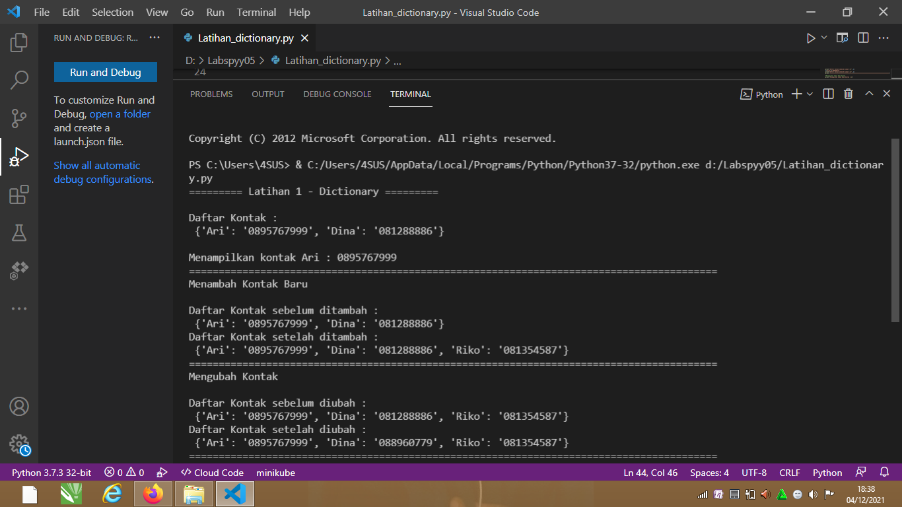

# latihann05
*Dictionary* adalah tipe data pada python yang berfungsi untuk menyimpan kumpulan data/nilai dengan pendekatan key-value. Setiap key dipisahkan dari value-nya oleh titik dua (:), sedangkan item dipisahkan oleh koma, dan semuanya tertutup dalam kurung kurawal {}.

Dictionary sendiri memiliki dua buah komponen inti:
1.	*Key* merupakan nama atribut suatu item pada dictionary.
2.	*Value* adalah nilai yang disimpan pada suatu atribut.

### A. Program

### B. Penjelasan

1. Membuat dictionary daftar kontak.
	python
	s={'Ari': '0895767999', 'Dina': '081288886'}
2. Untuk menampilkan salah satu kontak, gunakan `s['Ari']`. **s** adalah variable dictionary, sedangkan `['Ari']` adalah keys dari sebuah dictionary.
python
	print("Menampilkan kontak Ari :", s['Ari'])

3. Jika ingin menambahkan kontak baru gunakan `variable_dictionary['keys']=value;`. 
	python
	s['Riko']='081354587';
	
4. Untuk mengubah kontak yang lama dengan yang baru, gunakan `variable_dictionary['keys']=value;`. Disini saya akan  mengubah valuenya yang semula `'Dina': '081288886'` menjadi `'Dina': '088960779'`.
python
	s['Dina']='088960779';
5. Untuk menampilkan semua nama kontak, gunakan `keys()`.
	python
	print(s.keys())
	
6. Jika ingin menampilkan semua nomor kontak, gunakan `values()`.
	pyhton
	print(s.values())
	
7. Untuk menampilkan daftar kontak beserta nomor teleponnya, gunakan `items()`.
	pyhton
	print(s.items())
	
8. Untuk menghapus salah satu kontak, gunakan statement `del variable_dictionary[keys];`.
	python
	del s['Dina'];
	
### C. Output

#### Selesai